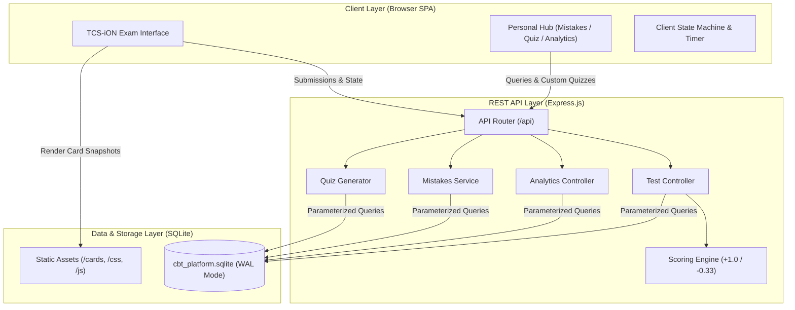
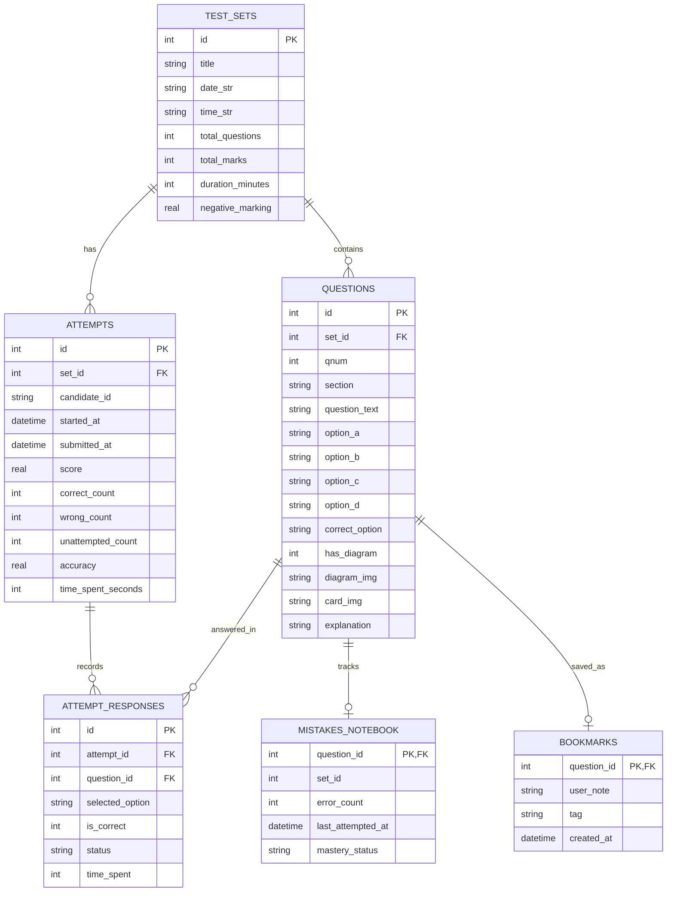
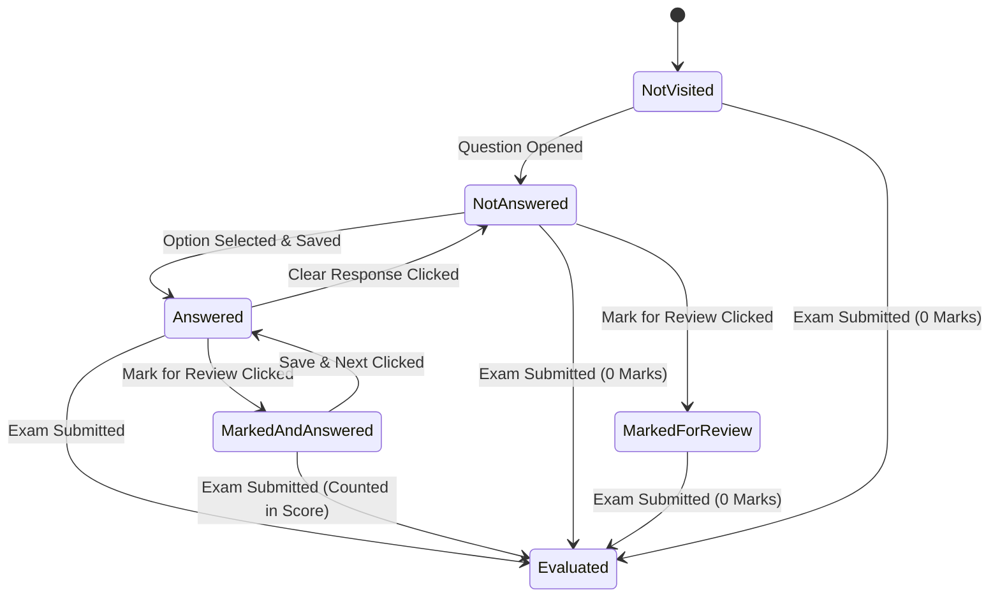

# 🏗️ System Architecture & Design Document
## RRB Technician Grade III CBT Platform & Analytics Engine

---

## 1. System Overview & Architecture

The system is designed as a **modular, local-first Full-Stack Examination Platform**. It features an event-driven Single Page Application (SPA) on the frontend, backed by a layered Node.js / Express REST API and a durable SQLite relational database running in WAL (Write-Ahead Logging) mode.

---

## 2. Entity-Relationship Data Model

---

## 3. Examination State Machine

---

## 4. Scoring Algorithm & Mathematical Formalism

Railway Recruitment Boards (RRB) use a standardized objective scoring formula:

$$\text{Total Raw Score} = \sum_{i=1}^{N} S_i$$

Where for question $i$:
$$S_i = \begin{cases} 
+1.00 & \text{if } \text{Option}_i = \text{AnswerKey}_i \\
-\frac{1}{3} \approx -0.3333 & \text{if } \text{Option}_i \neq \text{AnswerKey}_i \text{ and } \text{Option}_i \neq \emptyset \\
0.00 & \text{if } \text{Option}_i = \emptyset \text{ (Unattempted)}
\end{cases}$$

Accuracy is evaluated over attempted questions:
$$\text{Accuracy (\%)} = \left( \frac{\text{Correct}}{\text{Correct} + \text{Wrong}} \right) \times 100$$
